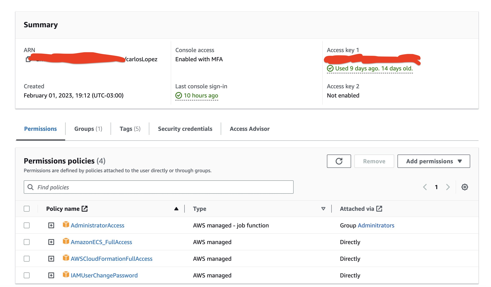
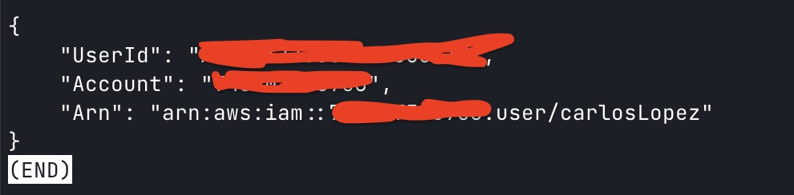
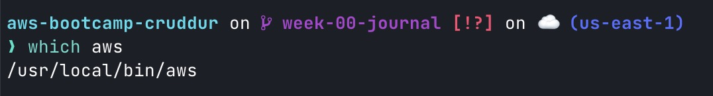
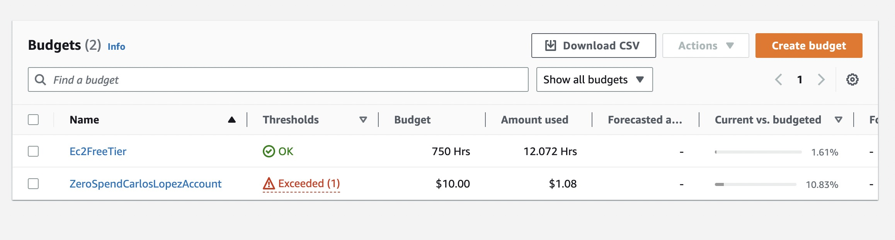
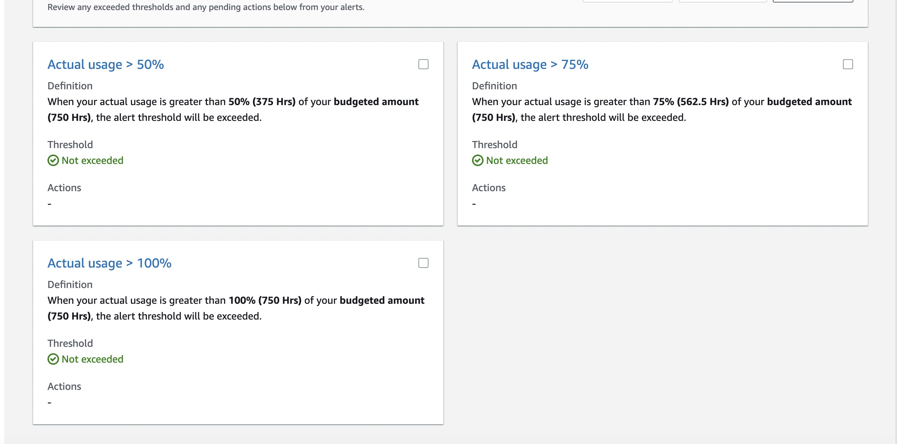
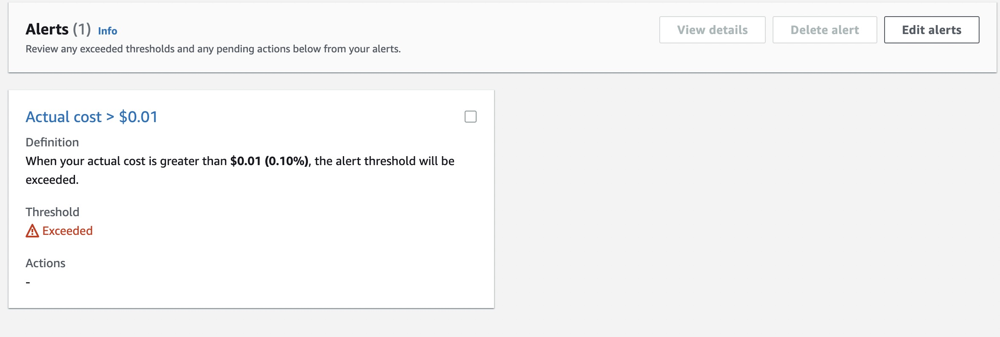

# Week 0 — Billing and Architecture

## Homework

- [X] Watch weekly videos
- [X] Create admin user
- [X] Generate AWS credentials
- [X] Install AWS CLI
- [X] Create Billing alarm
- [X] Create Budget
- [X] Recreate Logical architecture diagrams in LucidCharts
- [X] Recreate conceptual Diagram in LucidCharts or on a Napkin

## Create Admin User


I created my account using the AWS console and attached AdministratorAccess to my account

## Generate AWS Credentials



I had configured credentials in my computer, but with the command aws sts get-caller-identity I get my local configuration

## Install AWS CLI



I installed the AWS CLI in the path
```
/usr/local/bin/aws
```

## Creater billing alarm and Create Budget



I created two billing alarms one for FreeTier of computer EC2 hours and one for ZeroSpendBudget, but this account is shared with other people and the limit was reached



Also, I configured 3 thresholds to send me an email when the limit reached 50% , 75% and 100%.

My budget configuration is 1$ but the limit was reached




##  Recreate Logical architecture diagrams in LucidCharts

--TODO--


## Recreate conceptual Diagram in LucidCharts or on a Napkin

--TODO--
