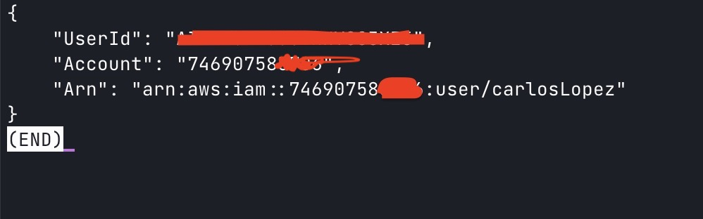

# Week 0 — Billing and Architecture

## Homework

- [X] Watch weekly videos
- [X] Create admin user
- [X] Generate AWS credentials
- [X] Install AWS CLI
- [X] Create Billing alarm
- [X] Create Budget
- [X] Recreate Logical architecture diagrams in LucidCharts
- [X] Recreate conceptual Diagram in LucidCharts or on a Napkin

## Create Admin User


I created my account using the AWS console and attached AdministratorAccess to my account

## Generate AWS Credentials



I had configured credentials in my computer, but with the command aws sts get-caller-identity I get my local configuration

## Install AWS CLI


I installed the AWS CLI in the path
```
/usr/local/bin/aws
```

## Creater billing alarm and Create Budget


I created two billing alarms one for FreeTier of computer EC2 hours and one for ZeroSpendBudget, but this account is shared with other people and the limit was reached


Also, I configured 3 thresholds to send me an email when the limit reached 50% , 75% and 100%.

My budget configuration is 10$ but the limit was reached


##  Recreate Logical architecture diagrams in LucidCharts


[Logical Architecture Diagram](https://lucid.app/lucidchart/11bd892c-2939-4271-9cf8-6abebb546edc/edit?viewport_loc=-11%2C-11%2C1675%2C892%2C0_0&invitationId=inv_d06292d4-5394-4839-b8a5-4a94d7ea789c)


## Recreate conceptual Diagram in LucidCharts or on a Napkin


[Conceptual diagram](https://lucid.app/lucidchart/94d817c3-a31e-412a-8d0e-9aa9bcdd7b02/edit?viewport_loc=-11%2C-11%2C1675%2C892%2C0_0&invitationId=inv_5cdee4c0-15d3-49e1-b16b-8db4c4cec58e)