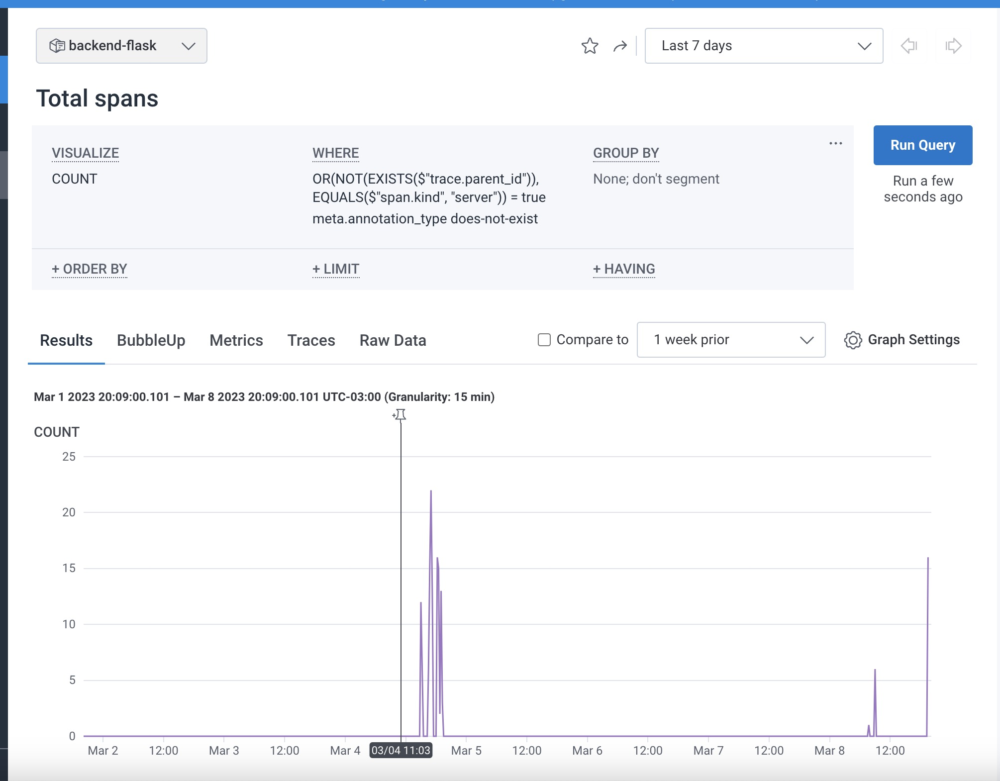

# Week 2 — Distributed Tracing

## Instrument Honeycomb with OTEL

First install:

```bash
opentelemetry-api
opentelemetry-sdk
opentelemetry-exporter-otlp-proto-http
opentelemetry-instrumentation-flask
opentelemetry-instrumentation-requests
```

Add this in app.py to implement your own instrumentation

```python
from opentelemetry import trace
from opentelemetry.instrumentation.flask import FlaskInstrumentor
from opentelemetry.instrumentation.requests import RequestsInstrumentor
from opentelemetry.exporter.otlp.proto.http.trace_exporter import OTLPSpanExporter
from opentelemetry.sdk.trace import TracerProvider
from opentelemetry.sdk.trace.export import BatchSpanProcessor
from opentelemetry.sdk.trace.export import SimpleSpanProcessor, ConsoleSpanExporter

FlaskInstrumentor().instrument_app(app)
RequestsInstrumentor().instrument()
    
```

Now, you can use the following function to send span

```python

from datetime import datetime, timedelta, timezone
from opentelemetry import trace

tracer = trace.get_tracer('home.activities')


class HomeActivities:
  def run():
    logger.info('HomeActivities')
    with tracer.start_as_current_span('http-handler'):
        span = trace.get_current_span()
        .
        .
        .
        return results
```



## Instrument AWS X-Ray

install the following packages

```bash
aws-xray-sdk
watchtower
```

Add the code in app.py

```python

## xray
from aws_xray_sdk.core import xray_recorder
from aws_xray_sdk.ext.flask.middleware import XRayMiddleware


LOGGER = logging.getLogger(__name__)
LOGGER.setLevel(logging.DEBUG)
console_handler = logging.StreamHandler()
LOGGER.addHandler(console_handler)
LOGGER.info("test log")


## xray----------
xray_url = os.getenv("AWS_XRAY_URL")
xray_recorder.configure(service="backend-flask",dynamic_naming=xray_url)


XRayMiddleware(app,xray_recorder)

```

To use X-Ray you can add this code on your functions

```python
class HomeActivities:
  def run(logger):
    logger.info('HomeActivities')
    ...
```


## Integrate Rollbar and capture and error

Add the following package to your project

```bash
blinker
rollbar
```

In app.py add this code to configure Rollbar

```python
## Rollbar
import os
import rollbar
import rollbar.contrib.flask
from flask import got_request_exception
```

Add this code to initialize Rollbar

```python
@app.before_first_request
def init_rollbar():
    """init rollbar module"""
    rollbar.init(
        # access token
        os.getenv('ROLLBAR_API_KEY'),
        # environment name
        'production',
        # server root directory, makes tracebacks prettier
        root=os.path.dirname(os.path.realpath(__file__)),
        # flask already sets up logging
        allow_logging_basic_config=False)

    # send exceptions from `app` to rollbar, using flask's signal system.
    got_request_exception.connect(rollbar.contrib.flask.report_exception, app)
```

And now you can use Rollbar

```python
@app.route('/rollbar/test')
def rollbar_test():
  rollbar.report_message('Hello world', 'warning')  
  return 'Hello world'
```


