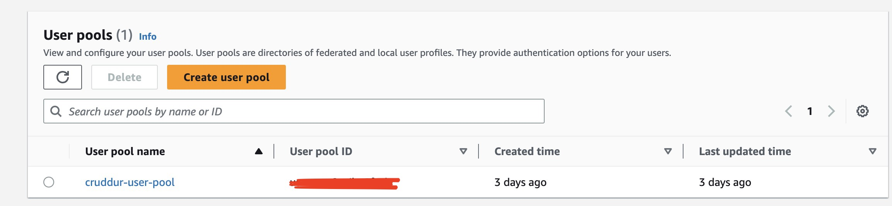
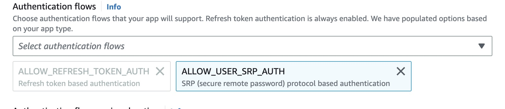

# Week 3 — Decentralized Authentication

## Create Cognito User Pool
****
Create a cognito user pool in AWS Console, and follow the configuration
to allow user authentication. We don't use AWS Cognito UI we use our own UI.



We must use this approach in auth user flow to allow authentication with a password in cognito



## Configure Amplify client-side library from Amazon Cognito
****
First we must add this environment variables in out react application to connect with cognito user pool

```bash

export REACT_APP_AWS_COGNITO_IDENTITY_POOL_ID=xxxxxxx
export REACT_AWS_COGNITO_POOL_ID=xxxxxxx
export REACT_APP_CLIENT_ID=xxxxxxx
export REACT_AWS_COGNITO_POOL_ID=xxxxxxx
```

Add this in docker-compose.yml file in `frontend-react-js`

```python
REACT_AWS_PROJECT_REGION : "${AWS_DEFAULT_REGION}"
REACT_APP_AWS_COGNITO_IDENTITY_POOL_ID : "${REACT_APP_AWS_COGNITO_IDENTITY_POOL_ID}"
REACT_APP_AWS_USER_POOLS_ID : "${REACT_AWS_COGNITO_POOL_ID}"
REACT_APP_CLIENT_ID : "${REACT_APP_CLIENT_ID}"
```
`REACT_AWS_PROJECT_REGION` need to be the same region where Cognito was created.

## Configure Amplify in Frotend Application
****

You need to install the next package

```bash
npm install aws-amplify
```

With this package could we send request to cognito to register, login, recovery password and get info from user in cognito.

To connect Cognito with our app is necessary to add this code in `App.js`

```js
import { Amplify } from 'aws-amplify';

Amplify.configure({
  "AWS_PROJECT_REGION": process.env.REACT_AWS_PROJECT_REGION,
  "aws_cognito_identity_pool_id": process.env.REACT_APP_AWS_COGNITO_IDENTITY_POOL_ID,
  "aws_cognito_region": process.env.REACT_APP_AWS_COGNITO_REGION,
  "aws_user_pools_id": process.env.REACT_APP_AWS_USER_POOLS_ID,
  "aws_user_pools_web_client_id": process.env.REACT_APP_CLIENT_ID,
  "oauth": {},
  Auth: {
    // We are not using an Identity Pool
    // identityPoolId: process.env.REACT_APP_IDENTITY_POOL_ID, // REQUIRED - Amazon Cognito Identity Pool ID
    region: process.env.REACT_AWS_PROJECT_REGION,           // REQUIRED - Amazon Cognito Region
    userPoolId: process.env.REACT_APP_AWS_USER_POOLS_ID,         // OPTIONAL - Amazon Cognito User Pool ID
    userPoolWebClientId: process.env.REACT_APP_AWS_USER_POOLS_WEB_CLIENT_ID,   // OPTIONAL - Amazon Cognito Web Client ID (26-char alphanumeric string)
  }
});
```
Now, we need to re-write components involved with authentication user

* ProfileInfo.js
* ConfirmationPage.js
* HomeFeedPage.js
* HomeFeedPage.js
* RecoverPage.js
* SigninPage.js
* SignupPage.js

In this components we are going to change `js-cookie` that handles auth flow to `aws-amplify`

It's important to add this code in the requests with authentication needed, to send JWT token to the authentication flow in our backend.

```js
js
  headers: {
    Authorization: `Bearer ${localStorage.getItem("access_token")}`
  }
```
## Backend Flow Authentication
****

We need to add some code in `App.py` to allow the Authorization header. We are going to  take the token al to authenticate user connection

```python
cors = CORS(
  app, 
  resources={r"/api/*": {"origins": origins}},
  headers=['Content-Type', 'Authorization'], 
  expose_headers='Authorization',
  methods="OPTIONS,GET,HEAD,POST"
)
```

For this time we check the token in `/api/activities/home` using Cognito endpoint, but in the future we need to make auth middleware to validate the token, if the token is not correct we return 401 error.

```python
@app.route("/api/activities/home", methods=['GET'])
def data_home():

  try:
    access_token = cognito_jwt_token.extract_access_token(request.headers)
    claims =  cognito_jwt_token.verify(token=access_token)
    data = HomeActivities.run(auth=True)
  except Exception as error:
    app.logger.error(error)
    data = HomeActivities.run(auth=False)
  
  return data, 200
```

Create file `/backend-flask/lib/cognito_jwt_token.py` and add

```python
import time
import requests
from jose import jwk, jwt
from jose.exceptions import JOSEError
from jose.utils import base64url_decode


class FlaskAWSCognitoError(Exception):
    pass


class TokenVerifyError(Exception):
    pass


class CognitoJWTToken:
    def __init__(self, user_pool_id, user_pool_client_id, region, request_client=None):
        self.region = region
        if not self.region:
            raise FlaskAWSCognitoError("No AWS region provided")
        self.user_pool_id = user_pool_id
        self.user_pool_client_id = user_pool_client_id
        self.claims = None
        if not request_client:
            self.request_client = requests.get
        else:
            self.request_client = request_client
        self._load_jwk_keys()

    @classmethod
    def extract_access_token(cls,request_headers):
        access_token = None
        auth_header = request_headers.get('Authorization')
        if auth_header and " " in auth_header:
            _, access_token = auth_header.split()
        return access_token
        
    def _load_jwk_keys(self):
        keys_url = f"https://cognito-idp.{self.region}.amazonaws.com/{self.user_pool_id}/.well-known/jwks.json"
        try:
            response = self.request_client(keys_url)
            self.jwk_keys = response.json()["keys"]
        except requests.exceptions.RequestException as e:
            raise FlaskAWSCognitoError(str(e)) from e

    @staticmethod
    def _extract_headers(token):
        try:
            headers = jwt.get_unverified_headers(token)
            return headers
        except JOSEError as e:
            raise TokenVerifyError(str(e)) from e

    def _find_pkey(self, headers):
        kid = headers["kid"]
        # search for the kid in the downloaded public keys
        key_index = -1
        for i in range(len(self.jwk_keys)):
            if kid == self.jwk_keys[i]["kid"]:
                key_index = i
                break
        if key_index == -1:
            raise TokenVerifyError("Public key not found in jwks.json")
        return self.jwk_keys[key_index]

    @staticmethod
    def _verify_signature(token, pkey_data):
        try:
            # construct the public key
            public_key = jwk.construct(pkey_data)
        except JOSEError as e:
            raise TokenVerifyError(str(e)) from e
        # get the last two sections of the token,
        # message and signature (encoded in base64)
        message, encoded_signature = str(token).rsplit(".", 1)
        # decode the signature
        decoded_signature = base64url_decode(encoded_signature.encode("utf-8"))
        # verify the signature
        if not public_key.verify(message.encode("utf8"), decoded_signature):
            raise TokenVerifyError("Signature verification failed")

    @staticmethod
    def _extract_claims(token):
        try:
            claims = jwt.get_unverified_claims(token)
            return claims
        except JOSEError as e:
            raise TokenVerifyError(str(e)) from e

    @staticmethod
    def _check_expiration(claims, current_time):
        if not current_time:
            current_time = time.time()
        if current_time > claims["exp"]:
            raise TokenVerifyError("Token is expired")  # probably another exception

    def _check_audience(self, claims):
        # and the Audience  (use claims['client_id'] if verifying an access token)
        audience = claims["aud"] if "aud" in claims else claims["client_id"]
        if audience != self.user_pool_client_id:
            raise TokenVerifyError("Token was not issued for this audience")

    def verify(self, token, current_time=None):
        """ https://github.com/awslabs/aws-support-tools/blob/master/Cognito/decode-verify-jwt/decode-verify-jwt.py """
        if not token:
            raise TokenVerifyError("No token provided")

        headers = self._extract_headers(token)
        pkey_data = self._find_pkey(headers)
        self._verify_signature(token, pkey_data)

        claims = self._extract_claims(token)
        self._check_expiration(claims, current_time)
        self._check_audience(claims)

        self.claims = claims
```

With this code, we take the token from request headers and send a request to Cognito endpoint validation if the token is `OK`. We return authorization if it's ok.

Don't forget add environment variables in `docker-compose.yml` from backend app

```bash
AWS_COGNITO_USER_POOL_ID: "${REACT_AWS_COGNITO_POOL_ID}"
AWS_COGNITO_USER_POOL_CLIENT_ID: "${REACT_APP_CLIENT_ID}"
```
****