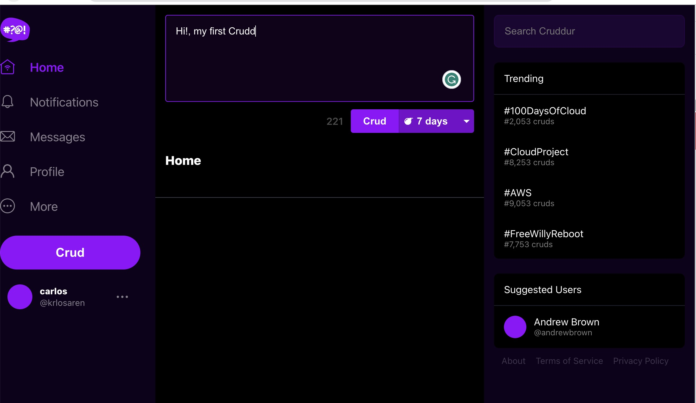

# Week 4 — Postgres and RDS

## Create RDS with AWS CLI

****
To create a RDS Database with AWS CLI you need to run this commands in you terminal with AWS Credentials.

```bash
aws rds create-db-instance \
  --db-instance-identifier cruddur-db-instance \
  --db-instance-class db.t3.micro \
  --engine postgres \
  --engine-version  14.6 \
  --master-username root \
  --master-user-password xxxxxxxxxxxxxx \
  --allocated-storage 20 \
  --availability-zone us-west-2a \
  --backup-retention-period 0 \
  --port 5432 \
  --no-multi-az \
  --db-name cruddur \
  --storage-type gp2 \
  --publicly-accessible \
  --storage-encrypted \
  --enable-performance-insights \
  --performance-insights-retention-period 7 \
  --no-deletion-protection
```

## Create bash scripts for Database Operations

****

**Connect DB**

```bash
#! /usr/bin/bash

CYAN='\033[1;36m'
NO_COLOR='\033[0m'
LABEL='db-connect'
printf "${CYAN}== ${LABEL}${NO_COLOR}\n"

echo "Connect to DB"

if [ "$1" = "prod" ]; then
    echo "Creating schema for prod"
    URL=$PROD_CON_URL
else
    echo "Create schema for ${1}"
    URL=$CONNECTION_URL
fi

echo "URL CONNECTION ${URL}"
psql $URL
```

**Create DB**

```bash
#! /usr/bin/bash

CYAN='\033[1;36m'
NO_COLOR='\033[0m'
LABEL='db-create'
printf "${CYAN}== ${LABEL}${NO_COLOR}\n"

echo "Create cruddur database..."
NO_DB_CONNECTION=$(sed 's/\/cruddur//g' <<< "$CONNECTION_URL")
psql $NO_DB_CONNECTION -c "CREATE DATABASE cruddur;"
echo "cruddur create..."
```

**Delete DB**

```bash
#! /usr/bin/bash

CYAN='\033[1;36m'
NO_COLOR='\033[0m'
LABEL='db-drop'
printf "${CYAN}== ${LABEL}${NO_COLOR}\n"

echo "Delete cruddur database"

NO_DB_CONNECTION=$(sed 's/\/cruddur//g' <<< "$CONNECTION_URL")
echo "DELETING ${NO_DB_CONNECTION}"
psql $NO_DB_CONNECTION -c "DROP DATABASE cruddur;"
echo "cruddur delete..."
```

**Create Schema**

```bash
#! /usr/bin/bash

CYAN='\033[1;36m'
NO_COLOR='\033[0m'
LABEL='db-schema-load'
printf "${CYAN}== ${LABEL}${NO_COLOR}\n"

schema_path=$(realpath .)/backend-flask/db/schema.sql
echo $schema_path

if [ "$1" = "prod" ]; then
    echo "Creating schema for prod"
    URL=$PROD_CON_URL
else
    echo "Create schema for ${1}"
    URL=$CONNECTION_URL
fi


echo $URL
psql $URL crudur < $schema_path

echo "cruddur create schemas tables..."
```

## Create activities

****

In `create_activity.py`, we need to add the follow code

```python
  @classmethod
  def create_activity(cls,handle_user,message, expires_at):
    sql = f"""
      INSERT INTO public.activities (user_uuid,message,expires_at) 
      VALUES (
        (SELECT uuid FROM public.users WHERE users.handle = %(handle_user)s LIMIT 1) ,%(message)s,%(expires_at)s) RETURNING uuid
    """
    uuid = db.query_commit_return_id(sql=sql,handle_user=handle_user,message=message,expires_at=expires_at)
    return CreateActivity.query_object_activity(uuid)

  @classmethod
  def query_object_activity(cls,uuid):

    sql = f"""
      SELECT
        activities.uuid,
        users.display_name,
        users.handle,
        activities.message,
        activities.replies_count,
        activities.reposts_count,
        activities.likes_count,
        activities.reply_to_activity_uuid,
        activities.expires_at,
        activities.created_at
      FROM public.activities
      LEFT JOIN public.users ON users.uuid = activities.user_uuid
      where public.activities.uuid  = %(uuid)s
      ORDER BY activities.created_at DESC
    """
    return db.query_object(sql,uuid= uuid)

```

With this code you can create a new activity and insert it into the database.

```python
    else:
      expires_at = (now + ttl_offset).isoformat()
      object_json = CreateActivity.create_activity(handle_user=user_handle,message=message,expires_at=expires_at)
      model['data'] = object_json
    return model
```
## Create class for DB querys

We will create a new file into `lib` called `db.py` and then add the follow code

```python
from psycopg_pool import ConnectionPool
import os
import sys
import re

import logging

logging.basicConfig(level=logging.INFO,format='%(levelname)s:%(message)s',)
logger = logging.getLogger(__name__)

class Db:
  def __init__(self):
    self.init_pool()
    
  def init_pool(self):
    self.connection_url = os.getenv('CONNECTION_URL')
    self.pool = ConnectionPool(self.connection_url)
  
  def print_psycopg_err(self,err):
    
    err_type, err_obj, traceback = sys.exc_info()
    line_num = traceback.tb_lineno

    print("\npsycopg2 ERROR:", err, "on line number:" , line_num)
    print("psycopg2 traceback:", traceback, "--- type:" , err_type)
  
  def query_wrap_object(self,template):
    sql = f"""
    (SELECT COALESCE(row_to_json(object_row),'{{}}'::json) FROM (
    {template}
    ) object_row);
    """
    return sql

  def query_wrap_array(self,template):
    sql = f"""
      (
        SELECT COALESCE(array_to_json(array_agg(row_to_json(array_row))),'[]'::json) 
        FROM ({template}) array_row
      );
    """
    return sql

  def query_array(self,sql,*args, **kwargs):
    wrapped_sql = self.query_wrap_array(sql)
    try:
      with self.pool.connection() as conn:
        with conn.cursor() as cur:
          cur.execute(wrapped_sql,kwargs)
          json = cur.fetchone()
          return json[0]
    except Exception as error:
      self.print_psycopg_err(error)
      return []

  def query_object(self,sql, *args, **kwargs):
    wrapped_sql = self.query_wrap_object(sql)
    with self.pool.connection() as conn:
      with conn.cursor() as cur:
        cur.execute(wrapped_sql,kwargs)
        json = cur.fetchone()
        return json[0]

  def query_commit_return_id(self, sql,*args,**kwargs):
    print('-SQL STATEMENT')

    pattern = r'\bRETURNING\b'
    match = bool(re.search(pattern, sql))
    returning_id = None

    try:
      with self.pool.connection() as conn:
        with conn.cursor() as cur:
          cur.execute(sql, kwargs)

          if match:
            returning_id = cur.fetchone()[0]
          
          conn.commit()
          return returning_id

    except Exception as error:
      self.print_psycopg_err(error)
      return None


  def query_commit(self,sql,*args):
    try:
      with self.pool.connection() as conn:
        with conn.cursor() as cur:
          conn.commit(sql)
    except Exception as error:
      self.print_psycopg_err(error)


db = Db()
```

This class have all the methods to execute transactions into the database





